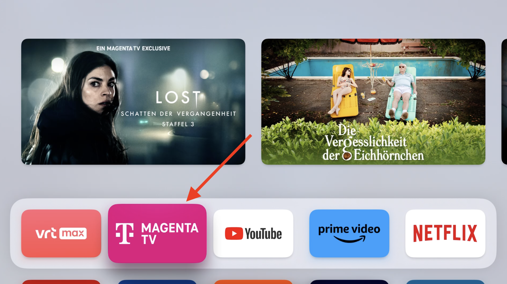
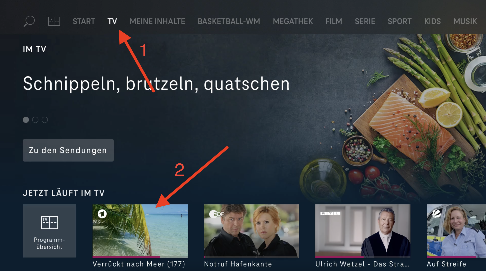

# TV

The TV in the house is equipped with an AppleTV. This means that only one remote control is necessary for control.

## Switching on and off

There is a button at the top right of the remote control for this purpose.

## Volume control

The volume is controlled with the buttons on bottom right of the remote control.

## Programme selection

The TV is used via various apps (similar to a smartphone). There are apps for TV channels (ARD, ZDF, RTL etc.), for streaming services (Amazon Prime, Netflix etc.) or other video services such as YouTube. Most services can be used without registration and subscription. For some services, such as Netflix, a paid subscription is necessary. If you already use Netflix at home, for example, you can simply and conveniently log in on the TV set with your access data and watch your films.

{: .warning }
Please do not forget to log out of all TV services to which you have logged in with your own access data before you leave.

## Watching LiveTV
To watch LiveTV there are two Apps available:
### vrt max
The app "vrt max" gives you access to some Belgium TV and Radio channels. Use the option "Live kijken" to switch to the Livestream. There is also an option to access some recorded shows inside this app.

### Magenta TV
The app "Magenta TV" allows you to watch most of the German TV channels and also some international channels. 
1. Start the app "Magenta TV" from the homescreen.

2. Select "TV" from the top navigation and select the cannel you would like to see.

### **Apple AirPlay**

If you own an Apple Device (iPhone, iPad, Mac) you can also stream media directly from you device to the TV via AirPlay.

<iframe width="560" height="315" src="https://www.youtube.com/embed/b4lp4o9WuF4" title="YouTube video player" frameborder="0" allow="accelerometer; autoplay; clipboard-write; encrypted-media; gyroscope; picture-in-picture; web-share" allowfullscreen></iframe>
